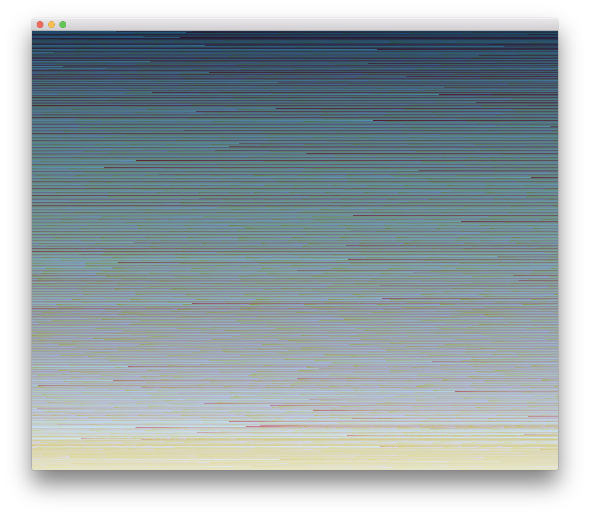
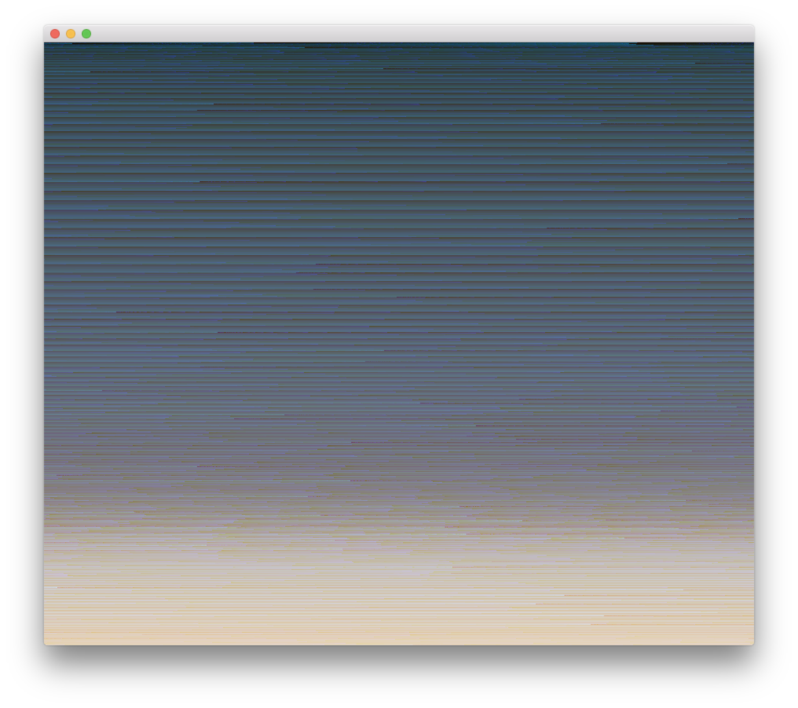
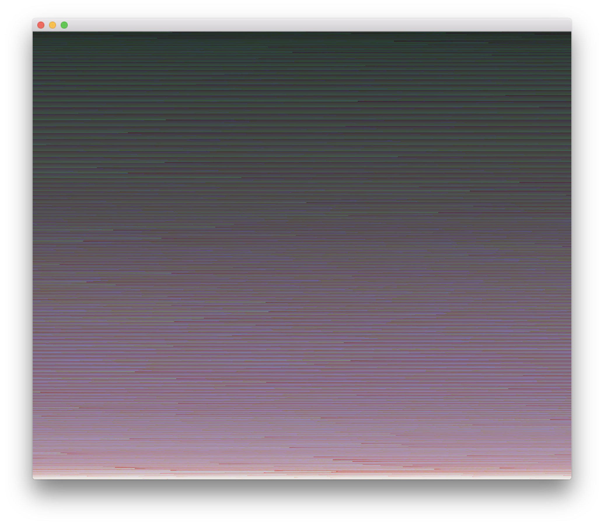

Pixel Sorting
---

The code contained here was written for part of my Summer Fellowship with UGA's [Center for Undergraduate Research Opportunities](https://curo.uga.edu/). Made in collaboration with [Mark Callahan](http://mazamedia.com/) of the [Lamar Dodd School of Art](https://art.uga.edu/) and [Ideas for Creative Exploration](http://ideasforcreativeexploration.com/).

If you'd like to try it out, you need openFrameworks first! [Go get it -->](http://openframeworks.cc/)

Alternatively, you can just use [this other tool I made](http://ctrotter.co/pixelsorting-web/) for the browser.

To build the app, first clone the repository:

    $ git clone https://github.com/touchRED/pixelsorting.git

Then, import the pixelsorting directory into the openFrameworks project generator. This step will construct your Makefile and XCode project file.

Once you're done importing it, go into the pixelsorting directory, compile and run:

    $ cd pixelsorting
    $ make && make RunRelease

Just drag an image onto the window to sort it! There are some example images you can play with in the bin/data/ folder.

Made with [openFrameworks](http://openframeworks.cc/).
